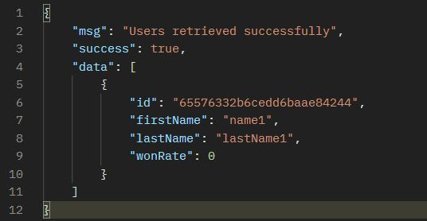
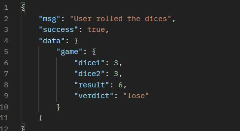

# Dice Game API

This is a Node.js application built with TypeScript that serves as an API for a dice game. Users can register, login, roll the dice, delete games, and perform other related actions. The application uses Mongoose as an Object Data Modeling (ODM) library for MongoDB and incorporates various features and dependencies like JWT for session management, bcryptjs for password hashing, dotenv for environment variables, Express for routing, jsonwebtoken for token generation, and mongoose for MongoDB integration.

## Table of Contents

- [Installation](#installation)
- [Screenshots](#screenshots)
- [Usage](#usage)
- [API Endpoints](#api-endpoints)
- [Configuration](#configuration)
- [Contributing](#contributing)
- [License](#license)

## Requirements

To run the application, please ensure that you have the following prerequisites in place:

1. **MongoDB Database**: Create a MongoDB database where the application will store and retrieve data. If you don't have MongoDB installed, you can download it from the official MongoDB website and follow the installation instructions.

2. **Environment Variables**: Create the .env file in the project directory and fill it with the necessary [configuration](#configuration) values. Specifically, you'll need to provide the connection details for your MongoDB database and a JWT Secret key.

Note: It's important to keep the `.env` file secure and not share it publicly, as it may contain sensitive information such as database credentials.

## Screenshots

Retrieve all users



User rolled the dices



## Installation

1. Clone the repository:

   ```
   git clone https://github.com/xllWhiteReaper/node
   ```

2. Change directories and enter the clone folder by using the following command:

   ```
   cd node
   ```

3. Switch branches to the develop branch by using the following command:

   ```
   git checkout develop
   ```

4. Navigate to the project directory:

   ```
   cd dice-game
   ```

5. Install the dependencies:

   ```
   npm i
   ```

6. Create a .env file in the root level

7. Fill the necessary environment files found in the [configuration subfield](#configuration)

8. Compile Typescript files to JavaScript:

   ```
   tsc
   ```

9. Explore the JavaScript files in the dist folder

10. Run the following command to start the application:

    ```
    npm run start
    ```

11. The API should run on the port you provided in your .env file or the port 3500

## Usage

The API provides several endpoints for user registration, authentication, game actions, and more. It follows a class-based approach with a separation of responsibilities to maintain a clean and scalable codebase. While the application serves as a functional dice game API, it's important to note that it is primarily designed as a learning project to explore the mentioned tools and technologies. Therefore, there might be areas that could be enhanced or optimized.

## API Endpoints

The following endpoints are available:

- `POST /api/auth/register`: Register a new user.
- `POST /api/auth/login`: Log in an existing user.
- `GET /api/users`: Gets all the the users' profile information.
- `GET /api/users/:id`: Gets a users' profile information by ID.
- `PUT /api/users/update/:id`: Updates a user by ID.
- `DELETE /api/users/delete`: Deletes a user by ID.
- `POST /api/games/roll-dice/:id`: Create a new game for a specific user.
- `GET /api/games/ranking`: Get the ranking of al players.
- `GET /api/games/best-players`: Get the users that won the most.
- `GET /api/games/worst-players`: Get the users that won the least.
- `DELETE /api/games/delete-by-user-id/:id`: Delete a specific game by providing the user ID as a param and the gameId in the body.

## Configuration

The application uses environment variables to manage configuration. The configuration file `.env` contains the following variables:

- `API_PORT`: The port number on which the server should listen.
- `MONGODB_URI`: The connection URI for the MongoDB database.
- `JWT_SING_KEY`: The secret key used for JWT token signing.

Make sure to configure these variables according to your setup before starting the application.

## Contributing

Contributions are welcome! If you find any issues or want to suggest improvements, please open an issue or submit a pull request.

## License

This project is licensed under the [APACHE 2.0 License](../LICENSE).
